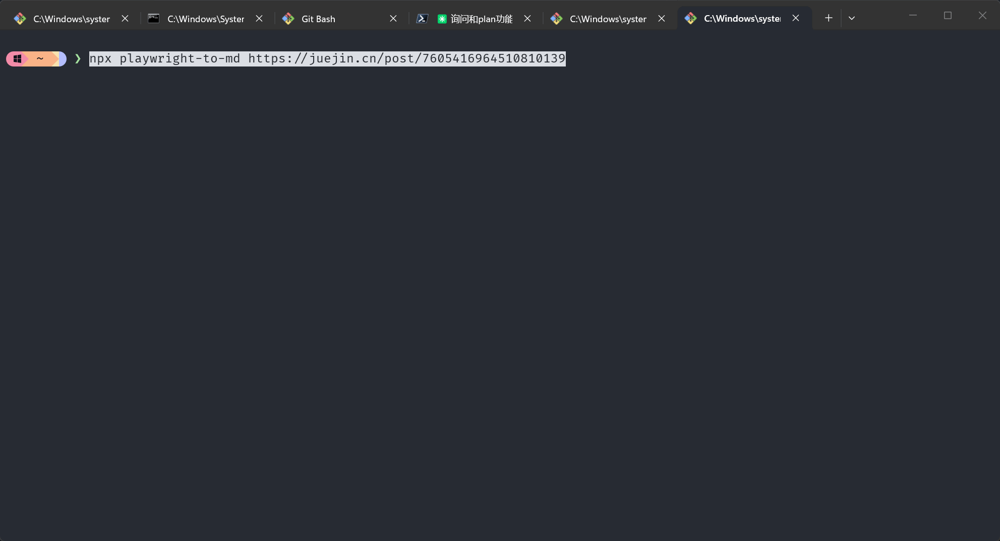

# playwright-to-md

> 告别复制粘贴，一行命令把网页变成干净的 Markdown。
>
> 采用 [Obsidian Web Clipper](https://github.com/obsidianmd/obsidian-clipper) 同款提取引擎，CLI 版本。


 


[English](./README_EN.md) | 中文

---

## 痛点

你是否遇到过这些问题？

- 看到一篇好文章，想保存到笔记软件，**复制粘贴后格式全乱** — 图片丢失、代码块变形、多余样式干扰
- 网页上有大量广告、侧边栏、评论区等噪音，**手动清理费时费力**
- 想抓取**需要登录**才能看到的内容（付费专栏），普通爬虫拿不到
- 网站有**反爬机制**，脚本刚跑就被拦
- SPA 页面内容是 JS 动态渲染的，**抓下来是空白**

`to-md` 就是为了解决这些问题而生的。

## 为什么选择 playwright-to-md

| 特性 | 说明 |
|------|------|
| JS 渲染 | Playwright 加载页面，SPA / 动态内容都能抓 |
| 反检测 | 移除 `navigator.webdriver` 标志，模拟真实浏览器 |
| 智能提取 | Defuddle 自动识别正文区域，去广告、导航、评论 |
| 复用登录态 | `--profile` 指定 Chrome 配置目录，直接复用 cookies |
| YAML frontmatter | 自动生成 title / author / date / source 元数据 |
| 懒加载图片 | 自动滚动触发 + `data-src` 修复 |
| 双浏览器 | 支持 Chrome 和 Edge |

## 支持站点

采用与 Obsidian Web Clipper 相同的 Defuddle 引擎，智能识别正文区域，**理论上支持所有文章类网页**。

| 类别 | 站点 |
|------|------|
| 技术社区 | 掘金、CSDN、博客园、SegmentFault、V2EX、思否 |
| 知识平台 | 知乎专栏、简书、少数派、语雀 |
| 代码托管 | GitHub、GitLab、Gitee |
| 博客系统 | WordPress、Hexo、Hugo、Typecho、Ghost |
| 新闻资讯 | 36氪、InfoQ、虎嗅、澎湃 |
| 国外站点 | Medium、Dev.to、Hashnode、Stack Overflow |
| 文档站点 | 各类技术文档、Wiki |

> 未列出的站点同样支持，Defuddle 会自动识别文章区域。

## 安装与使用

### 方式一：npx 直接运行（推荐尝鲜）

无需安装，直接执行：

```bash
npx playwright-to-md https://juejin.cn/post/7605416964510810139
npx playwright-to-md https://juejin.cn/post/7605416964510810139 -o article.md
```

### 方式二：全局安装（推荐常用）

```bash
npm install -g playwright-to-md

# 安装后即可直接使用
to-md https://juejin.cn/post/7605416964510810139
to-md https://juejin.cn/post/7605416964510810139 -o article.md
```

**前置要求：** Node.js >= 18，系统已安装 Chrome 浏览器。

## 命令行选项

```
to-md <url> [options]
```


| 选项 | 说明 | 默认值 |
|------|------|--------|
| `-o, --output <file>` | 输出到文件 | 终端输出 |
| `--browser <name>` | 浏览器：`chrome` 或 `msedge` | `chrome` |
| `--headless` / `--no-headless` | 无头模式 / 显示浏览器窗口 | 无头 |
| `--wait <ms>` | 额外等待时间（动态加载） | `0` |
| `--timeout <ms>` | 页面加载超时 | `30000` |
| `--profile <dir>` | Chrome/Edge 配置目录（保留登录态） | 无 |
| `--no-frontmatter` | 不输出 YAML frontmatter | - |
| `--json` | JSON 格式输出（含元数据） | - |

## 使用场景

### 抓取技术文章

```bash
# 掘金
to-md https://juejin.cn/post/7605416964510810139 -o article.md

# 知乎专栏

to-md --no-headless --browser msedge  https://zhuanlan.zhihu.com/p/7314838716

# CSDN
to-md https://blog.csdn.net/user/article/details/123456 -o article.md
```

### 抓取需要登录的页面

使用 `--profile` 指定 Chrome 用户数据目录，复用已有的登录状态：

```bash
# Windows
to-md https://example.com/member-only -o article.md --profile "C:\Users\你的用户名\AppData\Local\Google\Chrome\User Data"

# macOS
to-md https://example.com/member-only -o article.md --profile "~/Library/Application Support/Google/Chrome"

# Linux
to-md https://example.com/member-only -o article.md --profile "~/.config/google-chrome"
```

> 注意：`--profile` 模式会启动可见的 Chrome 窗口（非 headless），请勿在运行期间关闭浏览器。

### 处理动态加载的页面

部分站点内容通过 JavaScript 动态渲染，需要额外等待：

```bash
# 手动指定等待时间
to-md https://example.com/spa-page -o article.md --wait 3000

# 遇到内容过短时，也可以加大超时
to-md https://example.com/slow-page -o article.md --timeout 60000
```


## 工作原理

to-md 采用简洁的两步流程：Playwright 加载页面 → Defuddle 提取正文。

```
    ┌─────────────────────────┐
    │   Playwright 加载页面     │
    │   (反检测 + 懒加载触发)   │
    └────────────┬────────────┘
                 │
                 ▼
    ┌─────────────────────────┐
    │   Defuddle 提取正文       │
    │   (自动识别内容区域)      │
    │   (去广告/导航/评论)      │
    │   (直接输出 Markdown)     │
    └────────────┬────────────┘
                 │
                 ▼
    ┌─────────────────────────┐
    │   输出结果               │
    │   (Markdown / JSON)      │
    └─────────────────────────┘
```

### 内容提取

使用 [Defuddle](https://github.com/kepano/defuddle) 进行智能内容提取：

- 自动识别文章正文区域，无需手动配置选择器
- 去除广告、导航栏、侧边栏、评论区等噪音
- 直接输出 Markdown，无需额外转换步骤
- 支持主流博客、新闻、技术文档站点

### 反爬虫处理

浏览器启动时注入反检测脚本，模拟真实浏览器环境：

- 移除 `navigator.webdriver` 标志
- 伪装 `window.chrome` 对象和浏览器插件
- 模拟真实的屏幕尺寸和 WebGL 渲染器
- 隐藏 Playwright 痕迹

### 懒加载图片

页面加载后自动滚动触发懒加载，并修复 `data-src` 等属性确保图片正确显示。

## 特殊说明

大多数站点直接支持，以下站点需要特殊参数：

| 站点 | 说明 |
|------|------|
| 知乎 | 需 `--no-headless --browser msedge` 绕过反爬 |
| 需登录的站点 | 使用 `--profile` 复用 Chrome 登录态 |

## 本地开发

```bash
# 克隆仓库
git clone https://github.com/sweetwisdom/to-md.git
cd to-md

# 安装依赖
npm install

# 运行测试
node bin/cli.mjs https://example.com

# 输出到文件查看效果
node bin/cli.mjs https://juejin.cn/post/7605416964510810139 -o test_output.md
```

### 项目结构

```
to-md/
├── bin/
│   └── cli.mjs            # CLI 入口，编排提取流程
├── lib/
│   ├── browser.mjs        # Playwright 浏览器管理、反检测、懒加载
│   └── converter.mjs      # Defuddle 内容提取 + Markdown 格式化
└── package.json
```

## 相关项目

- [Obsidian Web Clipper](https://github.com/obsidianmd/obsidian-clipper) - 浏览器扩展版，本项目的灵感来源
- [Defuddle](https://github.com/kepano/defuddle) - 智能网页内容提取引擎
- [Playwright](https://github.com/microsoft/playwright) - 浏览器自动化框架

## License

[MIT](./LICENSE)
