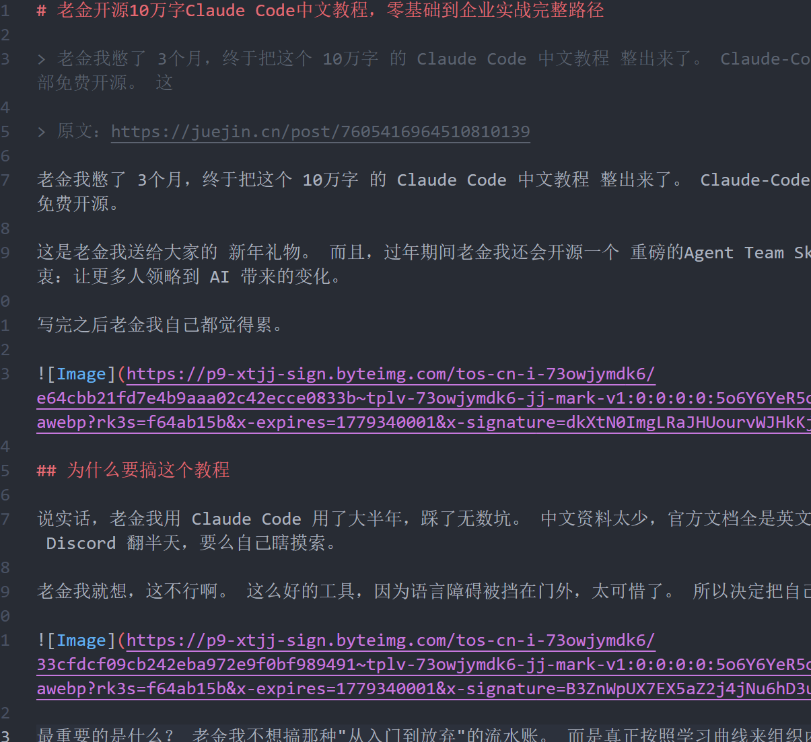

# 老金开源10万字Claude Code中文教程，零基础到企业实战完整路径

> 老金我憋了 3个月，终于把这个 10万字 的 Claude Code 中文教程 整出来了。 Claude-Code-Guide-Zh，10个完整教程、70+代码示例、120个FAQ，全部免费开源。 这

> 原文：https://juejin.cn/post/7605416964510810139

老金我憋了 3个月，终于把这个 10万字 的 Claude Code 中文教程 整出来了。 Claude-Code-Guide-Zh，10个完整教程、70+代码示例、120个FAQ，全部免费开源。

这是老金我送给大家的 新年礼物。 而且，过年期间老金我还会开源一个 重磅的Agent Team Skill，让 多Agent协作 变得像说话一样简单。 本着一个初衷：让更多人领略到 AI 带来的变化。

写完之后老金我自己都觉得累。

## 为什么要搞这个教程

说实话，老金我用 Claude Code 用了大半年，踩了无数坑。 中文资料太少，官方文档全是英文，很多功能根本不知道怎么用。 每次遇到问题，要么去 Discord 翻半天，要么自己瞎摸索。

老金我就想，这不行啊。 这么好的工具，因为语言障碍被挡在门外，太可惜了。 所以决定把自己的学习笔记整理成 系统化教程，免费开源给大家。

最重要的是什么？ 老金我不想搞那种"从入门到放弃"的流水账。 而是真正按照学习曲线来组织内容，零基础的人能看懂，有经验的人也能找到进阶内容。 这个教程的结构设计，老金我改了至少 5遍。

## 10万字都写了啥

先说数据。 10万字，不是那种凑字数的水文，而是真正的系统化内容。 10个完整教程，从零基础到企业实战，每一步都有详细说明。

70+代码示例，不是那种"自己看着办"的伪代码，而是可以直接跑的完整案例。 120个FAQ，基本上你能想到的坑，老金我都踩过了，这里都有答案。 老金我粗略算了一下，这个工作量至少得 3个月。

更关键的是，这个教程的 平均质量评分达到98分。 老金我按照 小白友好度、信息准确性、实战性 等8个维度严格打分。 而且所有信息都经过 WebSearch验证，确保准确可靠。

第一部分是 基础入门，教你怎么安装配置 Claude Code。 这部分老金我写得特别细，连 Windows 和 Mac 的差异都考虑到了。 因为老金我知道，很多人就是卡在安装这一步就放弃了。

第二部分是 核心功能，包括代码生成、重构、调试这些日常操作。 每个功能都有详细的使用场景和最佳实践。 比如代码重构那一章，不仅教你怎么用，还告诉你什么时候该用、什么时候不该用。

第三部分是 进阶技巧，Skills、Hooks、MCP服务器 这些高级功能。 这部分是老金我最喜欢的，因为这些功能能真正提升效率。 教程里不仅有理论讲解，还有实际案例，看完就能上手。

第四部分是 企业实战，团队协作、CI/CD集成、安全规范这些。 这部分对于想在公司推广 Claude Code 的人来说特别有用。 老金我把自己在团队里推广的经验都写进去了。

如果对你有帮助，记得关注一波~

## 4种学习路径，总有一种适合你

老金我设计了 4种学习路径，不同基础的人都能找到适合自己的方式。

路径A：快速上手（3小时） 适合零基础小白，只学最核心的功能。 第一步学安装配置（60分钟），第二步学MCP集成（30分钟），第三步学Hooks系统（30分钟）。 3小时就能上手，能用 Claude Code + 能用 MCP + 能用 Hook。

路径B：完整学习（24-34小时） 适合想系统掌握的人，按周学习，6周搞定。 从安装指南到Agent-SDK，每个教程都完整学习。

路径C：问题排查 遇到问题直接查FAQ，120个问题基本覆盖所有坑。

路径D：专项学习 有基础的人直接跳到感兴趣的教程，重点学习MCP、Hooks、Skills。

## 70+代码示例有多实用

代码示例是这个教程的另一个亮点。 不是那种"Hello World"级别的玩具代码，而是真正能解决实际问题的案例。

比如有一个示例是用 Claude Code 重构遗留代码。 从分析代码结构，到制定重构计划，再到具体实施，每一步都有详细代码。 老金我自己就是用这个方法重构了好几个老项目。

还有一个示例是配置自定义 Hooks。 这个功能老金我之前研究了好久才搞明白。 现在把完整代码和注释都写进教程了，你们可以直接拿去用。

最实用的是什么？

每个代码示例都有详细注释，不是那种"自己看着办"的风格。 而且还有常见错误提示，告诉你哪些坑要注意。 老金我觉得这个设计特别贴心，能省很多踩坑时间。

## 120个FAQ都是真实踩过的坑

FAQ 部分是老金我花时间最多的。 因为这些问题都是老金我实际使用中遇到的，不是那种"理论上可能"的问题。

比如"为什么 Claude Code 总是超出上下文限制？" 这个问题老金我之前也被折磨过，教程里给出了 5种解决方案。 从调整配置到优化提示词，每种方法都有详细说明。

还有"怎么在团队中推广 Claude Code？" 这个问题对于想在公司用 Claude Code 的人来说特别实用。 教程里不仅有技术方案，还有说服管理层的技巧，很接地气。

老金我粗略统计了一下，这 120个FAQ 覆盖了安装配置、日常使用、进阶技巧、团队协作四个方面。 基本上你能想到的问题，这里都有答案。

## 开源的初衷

老金我为什么要开源这个教程？ 说白了，就是想让更多人领略到 AI 带来的变化。

Claude Code 是个好工具，但中文资料太少，很多人想用但不知道怎么入门。 老金我就想，既然自己踩过这些坑了，为什么不把经验分享出来？ 让后面的人少走弯路，这不是挺好的事儿吗。

而且开源之后，社区可以一起完善，教程会越来越好。

最打动老金我的是什么？

我的开源知识库访问量已经越来越大了。 看到大家真的在用，老金我觉得这 3个月 没白费。

## 过年期间的重磅礼物：Agent Team Skill

对了，老金我过年期间还会开源一个 重磅的Agent Team Skill。 这个 Skill 可以让 Claude Code 的 多Agent协作 更简单，一句话就能自动组队。 手动挡时代 要结束了，自动化编排 才是未来。

这也是老金我送给大家的 新年礼物。 希望能帮助更多人提升开发效率，让 AI 真正成为你的编程伙伴。

## 老金我的建议

如果你想学 Claude Code，这个教程是个很好的起点。 零基础的人可以从头开始看，有经验的人可以直接跳到进阶部分。 教程结构清晰，内容详实，代码示例实用，FAQ 覆盖全面。

老金我建议你先把基础教程过一遍，然后跟着代码示例动手实践。 遇到问题就去 FAQ 里找答案，基本上能解决 90% 的问题。 等基础打牢了，再去看进阶教程和企业实战部分。

还有个 快速导航卡，一页纸速查表，把所有核心内容都浓缩了。 老金我建议你先看这个，了解全局，再开始学习。

项目地址：[github.com/KimYx0207/C…](https://link.juejin.cn/?target=https%3A%2F%2Fgithub.com%2FKimYx0207%2FClaude-Code-Guide-Zh "https://github.com/KimYx0207/Claude-Code-Guide-Zh") 老金我已经开源了，你们可以去 Star 支持一下。 有问题可以在项目里提 Issue，老金我会尽快回复。

这个教程是老金我用心整理的，希望能帮到你们。

* * *

**往期推荐：**

[AI编程教程列表](https://link.juejin.cn/?target=https%3A%2F%2Fmp.weixin.qq.com%2Fmp%2Fappmsgalbum%3F__biz%3DMzI0NzU2MDgyNA%3D%3D%26action%3Dgetalbum%26album_id%3D3704202865347362819%23wechat_redirect "https://mp.weixin.qq.com/mp/appmsgalbum?__biz=MzI0NzU2MDgyNA==&action=getalbum&album_id=3704202865347362819#wechat_redirect")

[提示词工工程（Prompt Engineering）](https://link.juejin.cn/?target=https%3A%2F%2Fmp.weixin.qq.com%2Fmp%2Fappmsgalbum%3F__biz%3DMzI0NzU2MDgyNA%3D%3D%26action%3Dgetalbum%26album_id%3D4120385726238392327%23wechat_redirect "https://mp.weixin.qq.com/mp/appmsgalbum?__biz=MzI0NzU2MDgyNA==&action=getalbum&album_id=4120385726238392327#wechat_redirect")

[LLMOPS(大语言模运维平台)](https://link.juejin.cn/?target=https%3A%2F%2Fmp.weixin.qq.com%2Fmp%2Fappmsgalbum%3F__biz%3DMzI0NzU2MDgyNA%3D%3D%26action%3Dgetalbum%26album_id%3D3171759118513111043%23wechat_redirect "https://mp.weixin.qq.com/mp/appmsgalbum?__biz=MzI0NzU2MDgyNA==&action=getalbum&album_id=3171759118513111043#wechat_redirect")

[AI绘画教程列表](https://link.juejin.cn/?target=https%3A%2F%2Fmp.weixin.qq.com%2Fmp%2Fappmsgalbum%3F__biz%3DMzI0NzU2MDgyNA%3D%3D%26action%3Dgetalbum%26album_id%3D3192433076551843848%23wechat_redirect "https://mp.weixin.qq.com/mp/appmsgalbum?__biz=MzI0NzU2MDgyNA==&action=getalbum&album_id=3192433076551843848#wechat_redirect")

[WX机器人教程列表](https://link.juejin.cn/?target=https%3A%2F%2Fmp.weixin.qq.com%2Fmp%2Fappmsgalbum%3F__biz%3DMzI0NzU2MDgyNA%3D%3D%26action%3Dgetalbum%26album_id%3D3502843007181520907%23wechat_redirect "https://mp.weixin.qq.com/mp/appmsgalbum?__biz=MzI0NzU2MDgyNA==&action=getalbum&album_id=3502843007181520907#wechat_redirect")

* * *

每次我都想提醒一下，这不是凡尔赛，是希望有想法的人勇敢冲。 我不会代码，我英语也不好，但是我做出来了很多东西，在文末的开源知识库可见。 我真心希望能影响更多的人来尝试新的技巧，迎接新的时代。

谢谢你读我的文章。 如果觉得不错，随手点个赞、在看、转发三连吧🙂 如果想第一时间收到推送，也可以给我个星标⭐～谢谢你看我的文章。

开源知识库地址： [tffyvtlai4.feishu.cn/wiki/OhQ8wq…](https://link.juejin.cn/?target=https%3A%2F%2Ftffyvtlai4.feishu.cn%2Fwiki%2FOhQ8wqntFihcI1kWVDlcNdpznFf "https://tffyvtlai4.feishu.cn/wiki/OhQ8wqntFihcI1kWVDlcNdpznFf")